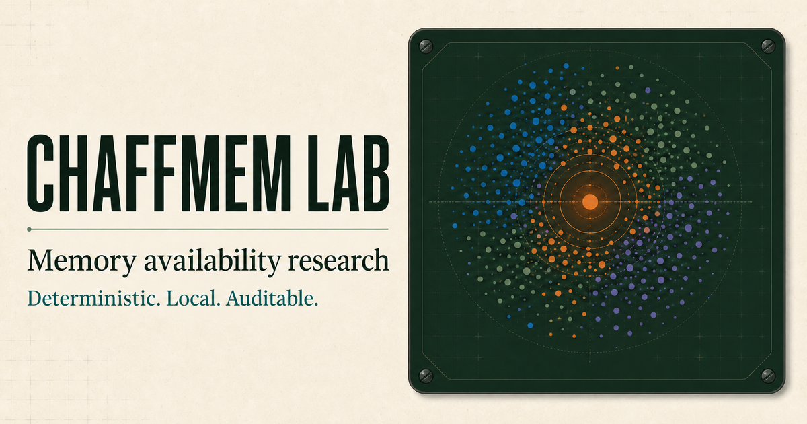
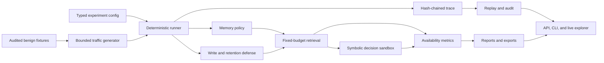

# ChaffMem Lab

ChaffMem Lab studies memory availability in bounded agent systems. It asks whether one important and true memory remains stored, retrievable, and useful after the system receives many individually harmless records near the same topic.

This repository is a working research prototype. It includes a deterministic Python engine, a local API, a command line interface, a live browser application, replayable traces, controlled comparison arms, tests, and generated smoke-study artifacts.

It does not establish that any commercial system is vulnerable. It does not claim a new state of the art result. Full cross-domain benchmarks and statistical conclusions remain open research work.

[Open the live Saturation Explorer](https://chaffmem-lab-pxnkit.brahmkhatripankit.chatgpt.site)



## Five-minute CPU quick start

The default path uses deterministic feature hashing and requires no model download, API key, private dataset, or GPU.

### Python research engine

```bash
python -m venv .venv
```

Windows PowerShell:

```powershell
.\.venv\Scripts\Activate.ps1
python -m pip install --upgrade pip
pip install -e ".[dev]"
chaffmem run configs/benchmark/smoke.yaml
```

Linux and macOS:

```bash
source .venv/bin/activate
python -m pip install --upgrade pip
pip install -e ".[dev]"
chaffmem run configs/benchmark/smoke.yaml
```

The run writes an immutable manifest, a hash-chained event trace, trajectory metrics, and an HTML report under `artifacts/runs`.

### Live application

```bash
npm ci
npm run dev
```

Open `http://localhost:3000`.

### API

```bash
chaffmem serve
```

Open `http://127.0.0.1:8000/docs` for the generated OpenAPI interface.

## What is implemented

- Versioned memory, query, retrieval, experiment, trace, and metric schemas
- Deterministic signed feature-hash embeddings
- Fixed-capacity memory with FIFO, LRU, reservoir, importance, diversity, and hybrid policies
- Matched benign traffic and bounded random, same-domain, semantic, diverse, multi-origin, and adaptive chaff streams
- Duplicate control, origin quota, semantic coverage, criticality retention, and canary-guided defenses
- Separate physical, retrieval, behavioral, and temporal availability measurements
- A symbolic downstream decision sandbox with no external tools
- Append-only trace events with chained integrity hashes
- Snapshot, restore, replay, comparison, audit, report, and export workflows
- A typed FastAPI service with health, catalog, experiment, memory, canary, trace, metric, and artifact routes
- A responsive browser application with keyboard-accessible controls and data tables
- Matched undefended, selected-defense, unlimited-storage, and gold-pin storage controls
- CPU smoke configurations, regression fixtures, CI, Docker, and reproducibility checks

## What is not demonstrated

- Vulnerability of a named hosted assistant or commercial memory product
- Transfer to a learned embedding model
- Robustness at production traffic volume
- A statistically supported effect across every policy and domain
- Superiority over every simple baseline
- Security certification or production hardening

The claim registry in `paper/claims.md` marks each statement as supported by a local smoke result, implemented but not evaluated, or untested.

## Research question

A memory record can remain present but still become unavailable to the agent. ChaffMem Lab measures four related outcomes:

1. Physical availability asks whether the record still exists
2. Retrieval availability asks whether it appears inside a fixed top-k result
3. Behavioral availability asks whether a downstream decision uses it
4. Temporal availability asks how long these properties survive along a write trajectory

The attack surface is intentionally narrow. Chaff records are benign statements from an audited fixture set. They contain no instruction, code, secret, false correction, or request to modify the target. The attacker controls only a bounded sequence of writes, their timing, their origin labels, and candidate selection inside the local simulator.

## Architecture



The browser application contains a deterministic reference engine so the public demo works without a hosted Python service. The Python package is the authoritative research implementation used for benchmark execution, persistence, replay, and artifact generation.

## Repository map

```text
app/                    Live Saturation Explorer
src/chaffmem/           Python research engine and service
configs/                Smoke, attack, defense, and study configurations
data/fixtures/          Audited benign records and reference scenarios
tests/                  Browser and Python validation
scripts/                Reproduction and artifact helpers
paper/                  Claim registry and research documentation
reports/generated/      Figures and tables built from raw run artifacts
artifacts/               Local run outputs, ignored by Git
worker/                  Cloudflare-compatible web entry point
```

## Run an experiment

Validate the configuration first:

```bash
chaffmem validate-config configs/benchmark/smoke.yaml
```

Execute the CPU smoke study:

```bash
chaffmem run configs/benchmark/smoke.yaml
```

Replay an existing run:

```bash
chaffmem replay artifacts/runs/RUN_ID/manifest.json
```

Compare two runs:

```bash
chaffmem compare artifacts/runs/RUN_A artifacts/runs/RUN_B
```

Export metrics:

```bash
chaffmem export artifacts/runs/RUN_ID --format csv
```

Audit a snapshot and its event chain:

```bash
chaffmem audit-store artifacts/runs/RUN_ID/snapshot.json
```

Rebuild the small reference artifact from scratch:

```bash
python scripts/reproduce_reference.py
```

## Experiment configuration

Every run fixes the following inputs:

- Memory policy and capacity
- Retrieval mode and top-k budget
- Benchmark domain
- Traffic or attack strategy
- Write budget and knowledge condition
- Origin and timing strategy
- Defense and thresholds
- Embedding backend
- Seed and schema version

The normalized configuration is stored in the run manifest. The manifest also records source, runtime, dependency, fixture, and trace hashes. A replay fails with a nonzero exit code if an integrity check changes.

## API surface

The local service exposes versioned routes for:

- Creating, running, pausing, resuming, and replaying experiments
- Reading experiment state, metrics, trace events, and artifacts
- Writing and querying a bounded memory store
- Taking and auditing snapshots
- Listing policies, attacks, and defenses
- Evaluating availability canaries
- Health and readiness checks

The service rejects arbitrary artifact paths, unknown strategies, non-finite vectors, fields beyond their declared bounds, and inconsistent idempotency keys.

## Evaluation

The primary smoke comparison holds the seed, benign background stream, capacity, retrieval budget, and target record constant. It varies the traffic strategy and defense. The runner reports:

- Critical Recall@k over the full trajectory
- Physical target retention
- Final target rank
- Writes to first retrieval failure
- Behavioral safety rate in the symbolic sandbox
- Benign utility on matched ordinary queries
- Accepted and rejected write counts
- Canary warning score

Simple baselines stay in the study even when they perform well. Unlimited storage and gold pinning are labeled as non-deployable storage controls. They bound physical retention, not retrieval quality.

### Frozen smoke result

The committed reference is a deterministic, single-seed pipeline check. It is not a statistical study.

| Arm | Critical Recall@4 | Physical availability | Writes to first failure | Rejected writes |
| --- | ---: | ---: | ---: | ---: |
| Matched benign | 0.48 | 0.48 | 12 | 0 |
| Random | 0.48 | 0.48 | 12 | 0 |
| Query-nearest | 0.16 | 0.48 | 4 | 0 |
| Adaptive admission | 1.00 | 1.00 | none | 23 |
| Gold-pin storage control | 0.16 | 1.00 | 4 | 0 |

The result demonstrates three narrow facts inside the synthetic FIFO condition. Query-nearest traffic reached retrieval failure before matched traffic, the aggressive adaptive arm preserved retrieval by rejecting most targeted writes, and storage pinning alone did not preserve top-k access. Raw traces, manifests, snapshots, and reports are under `artifacts/reference`.

## Reproducibility

A deterministic run records:

- Complete normalized configuration
- Random seed
- Python version, operating system, and architecture
- Installed dependency versions
- Source-tree and fixture hashes
- Policy, attack, defense, seed, and schema identifiers
- Trace, snapshot, metric, report, and result hashes
- Artifact generation timestamp

Use the same seed and configuration to reproduce the event digest. Use a new experiment identifier before changing a frozen test manifest.

## Testing

Run the Python suite:

```bash
pytest
```

Run coverage:

```bash
coverage run -m pytest
coverage report -m
```

Run static checks:

```bash
ruff check src tests
mypy src
```

Run type checking, the web build, simulator invariants, and the server-render test:

```bash
npm run typecheck
npm test
```

The suite covers schema validation, deterministic embeddings, eviction conformance, attack budgets, defense admission, target retrieval, event-chain integrity, snapshot replay, API contracts, CLI smoke paths, and extreme capacity cases.

## Docker

```bash
docker compose up --build
```

The API is available at `http://127.0.0.1:8000`. The container uses the deterministic CPU configuration and does not require secrets.

## Safety boundary

This repository is for defensive research on local memory implementations.

- Do not connect it to a hosted assistant for adversarial testing
- Do not add prompt injection, executable payloads, credential access, persistence, or evasion
- Keep traffic inside disposable local stores
- Use only benign and auditable fixture records
- Treat alerts as research signals, not proof of an attack
- Do not infer a product vulnerability from this simulator

See `SECURITY.md` and `paper/ethics.md` for reporting and responsible-use guidance.

## Known limitations

The default embedding is intentionally lightweight. It supports reproducible CPU studies but does not represent the geometry of a learned production retriever. The live browser engine mirrors the study concepts but is not the source of publication evidence. Smoke runs are too small for a broad statistical conclusion. The symbolic behavior task isolates causal use of a memory but does not model every failure mode of an LLM agent.

## Originality and provenance

The repository contains an independent implementation written for this project. No third-party source code, experiment output, prose, figure, dataset, or model weight is bundled. Broad research concepts such as bounded storage, retrieval ranking, quotas, replay, and canary monitoring are implemented through project-specific interfaces and deterministic fixtures.

Any future integration that incorporates a third-party method, dataset, model, or codebase must add its license and scholarly attribution before release.

## Contributing

Read `CONTRIBUTING.md` before adding a policy, traffic strategy, defense, domain, or embedding backend. New components need deterministic tests, provenance fields, a safety review, and at least one matched baseline.

## License

Code is released under the MIT License. Research results generated by a user remain subject to the terms of any data or model they add.

## Citation

If you use this software artifact, cite the repository metadata in `CITATION.cff`. Do not cite the smoke output as evidence for a broader claim without running the declared study and reporting its uncertainty.
